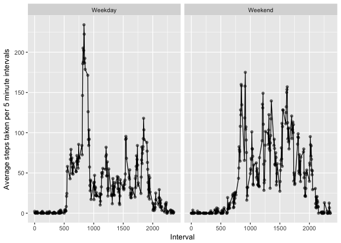

### Loading the data

```r
source("libraries.R")
activity <- fread("data/activity.csv")
activity
```

```
##        steps       date interval
##     1:    NA 2012-10-01        0
##     2:    NA 2012-10-01        5
##     3:    NA 2012-10-01       10
##     4:    NA 2012-10-01       15
##     5:    NA 2012-10-01       20
##    ---                          
## 17564:    NA 2012-11-30     2335
## 17565:    NA 2012-11-30     2340
## 17566:    NA 2012-11-30     2345
## 17567:    NA 2012-11-30     2350
## 17568:    NA 2012-11-30     2355
```


### Distribution of total steps per day

```r
total_steps <- activity[, .(total_steps = sum(steps, na.rm = TRUE)), date]
ggplot(data = total_steps[!is.na(total_steps)], 
       aes(x = total_steps)) + 
  geom_histogram() +
  labs(x = "Total number of steps per day", y = "")
```

<!-- -->

```r
knitr::kable(
  total_steps[, .(median_total_steps = prettyNum(median(total_steps, na.rm = TRUE), big.mark = " "),
                  mean_total_steps = prettyNum(mean(total_steps, na.rm = TRUE), big.mark = " "))]
)
```


median_total_steps   mean_total_steps 
-------------------  -----------------
10 395               9 354.23         


### Average daily activity pattern

```r
average_steps <- activity[, .(ave_steps_per_5min = mean(steps, na.rm = T)), interval]
average_steps[, max_steps := max(ave_steps_per_5min, na.rm = T)]
max_steps_interval <- average_steps[ave_steps_per_5min == max_steps, interval]
max_steps <- average_steps[ave_steps_per_5min == max_steps, max_steps]

ggplot(data = average_steps,
       aes(x = interval,
           y = ave_steps_per_5min)) +
  geom_line() +
  geom_point(alpha = 0.5) +
  geom_vline(xintercept = max_steps_interval, color = "red")
```

<!-- -->


The most active interval is **835** which means that the participants of the study had one average the most steps (206.17) between **08:35** and **08:40 AM**.


### Missing value imputation

```r
n_missing <- nrow(activity[is.na(steps)])
p_missing <- paste0(round(100 * n_missing / nrow(activity), 2), "%")
```

There are 2304 rows where the steps variable has missing values which is 13.11% of the whole dataset. We are going to substitute these using the following algorithm:
1. draw a sample from observations with the same *interval* as the missing one
2. calculate the sample mean of *steps*
3. imputing the sample mean


```r
activity[, imputed_steps := as.numeric(copy(steps))]
donor_table <- activity[!is.na(steps)]
na_index <- which(is.na(activity$steps))
set.seed(1234)
for (i in na_index)
{
    na_interval <- activity[i, interval]
    sample <- sample(x = donor_table[interval == na_interval, steps],
                     size = 10,
                     replace = TRUE)
  
    activity[i, imputed_steps := mean(sample)]
}
```


```r
total_steps <- activity[, .(total_sends_imputed = sum(imputed_steps)), date]
ggplot(data = total_steps, 
       aes(x = total_sends_imputed)) + 
  geom_histogram() +
  labs(x = "Total number of steps per day (imputed)", y = "")
```

<!-- -->

```r
knitr::kable(
  total_steps[, .(median_total_steps = prettyNum(median(total_sends_imputed, na.rm = TRUE), big.mark = " "),
                  mean_total_steps = prettyNum(mean(total_sends_imputed, na.rm = TRUE), big.mark = " "))]
)
```


median_total_steps   mean_total_steps 
-------------------  -----------------
10 765               10 736.03        


### Weekday effect in activity patterns

```r
activity[, weekday := as.factor(ifelse(format.Date(date, "%u") < 6, "Weekday", "Weekend"))]
average_steps <- activity[, .(ave_steps_per_5min = mean(steps, na.rm = T)), .(interval, weekday)]
average_steps[, max_steps := max(ave_steps_per_5min, na.rm = T)]
max_steps_interval <- average_steps[ave_steps_per_5min == max_steps, interval]
max_steps <- average_steps[ave_steps_per_5min == max_steps, max_steps]

ggplot(data = average_steps,
       aes(x = interval,
           y = ave_steps_per_5min)) +
  geom_line() +
  geom_point(alpha = 0.5) +
  facet_grid(~weekday) +
  labs(x = "Interval", y = "Average steps taken per 5 minute intervals")
```

<!-- -->
